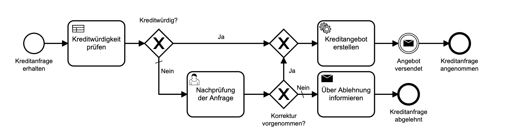
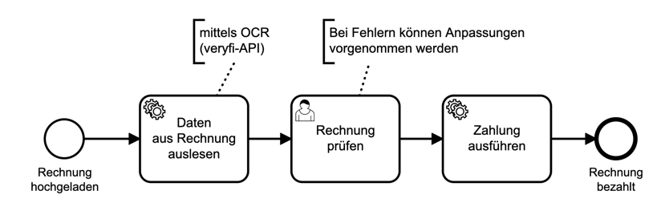

# BPMNANDAI

Im Rahmen dieses Projektes sollen <b>BPMN basierte Prozesse</b>, 
durch den Einsatz von <b>Künstlicher Intelligenz</b> automatisiert werden

### KI in Form einer DMN-Tabelle abbilden

...abgebildet als Business Rule Task - 
und angesprochen durch die Camunda DMN-Engine, 
welche direkt in die Camunda BPMN Engine integriert ist

---

### KI im PMML-Format in DMN-Model einbinden

...abgebildet als Business Rule Task - 
und angesprochen durch eine dedizierte DMN-Engine 
(<a href="https://drools.org">Drools DMN-/Rule-Engine</a>)

---

### KI über Service-Task integrieren

Durch diesen Prozess wird die Zahlung von Eingangsrechnungen automatisiert. 
Dabei werden durch die eine Künstliche Intelligenz (OCR = Machine Learning) Daten aus den Rechnungen extrahiert. 
Diese Daten sind z.B. die Rechnungspositionen, der Rechnungsbetrag und weitere Zahlungsinformationen.

---